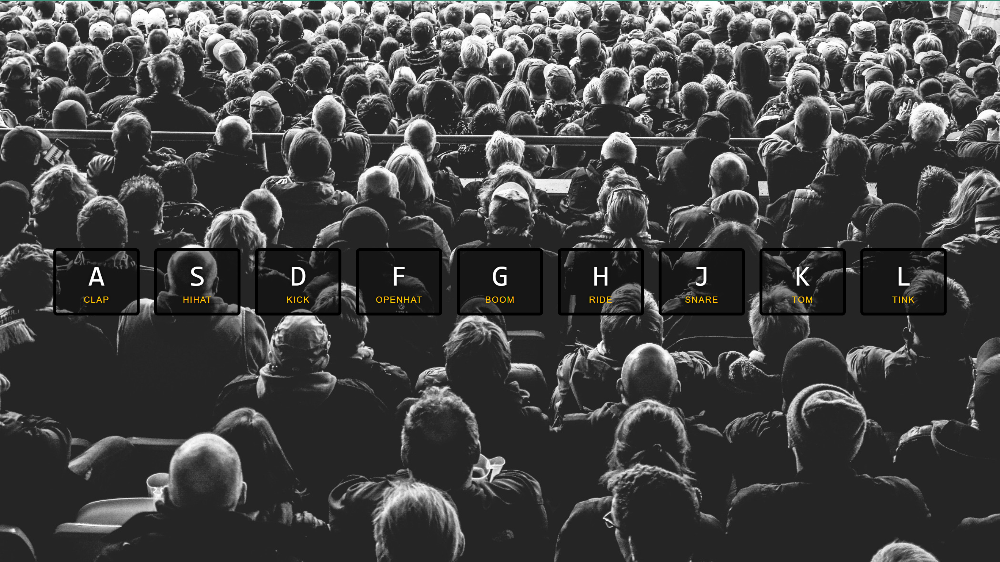

## My Portfolio Project

- Here are the web components we designed using HTML5 , CSS3.

- Here are page structures made usign HTML5 and CSS3 that you can use everywhere.

# JS Drumkit Project

## Description

Project aims to create a javaScript project with sound files.

- https://morcicek.github.io/DrumKit-JS/

## Project ScreenShoot



## Project Skeleton

```
001-survey-form (folder)
|
|----readme.md         # Given to the students (Definition of the project)
|----solution
        |----index-START.html
        |----style.css
        |----script.js
```

### At the end of the project, following topics are to be covered;

- HTML Datakeys

- HTML with sound files

- CSS Colors-Border Properties

- CSS Margins-Padding

- CSS Properties for Texts-Font Families-Links

- javaScript Function

- javaScript DOM

- javaScript Event

### At the end of the project, students will be able to;

- improve coding skills within HTML & CSS & JS

- use git commands (push, pull, commit, add etc.) and Github as Version Control System.

## Notes

- You can use HTML,CSS and javaScript o complete this project.

## Resources

<center> &#8987; Happy Coding  &#9997; </center>
